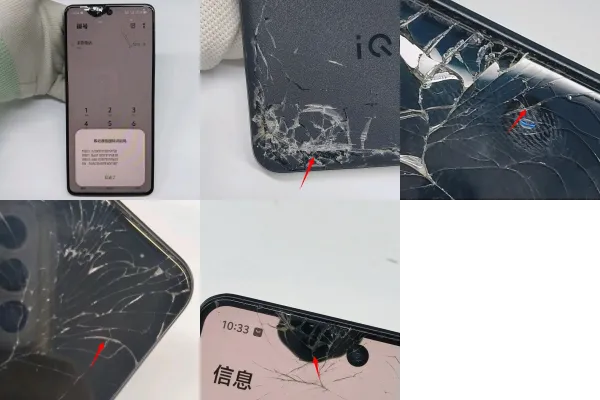
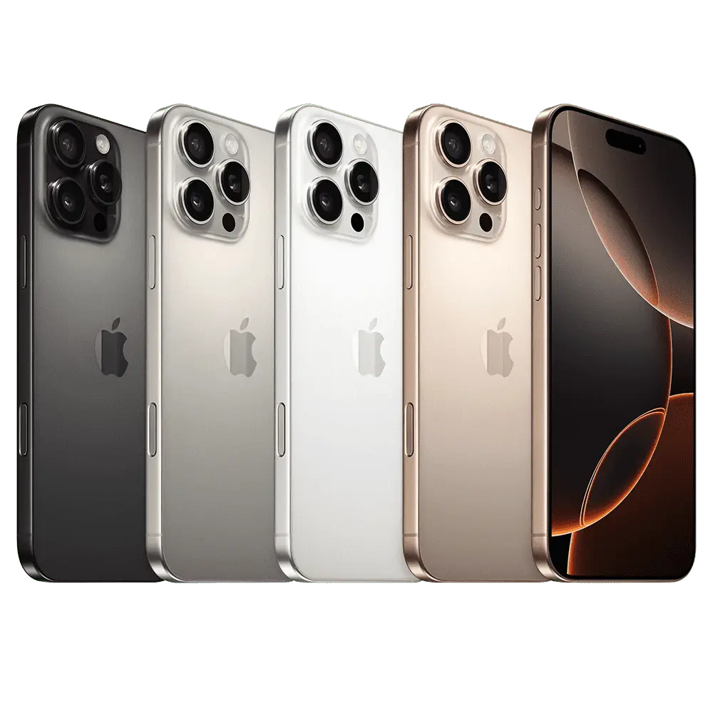
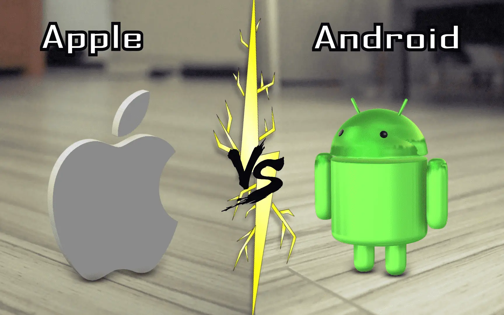
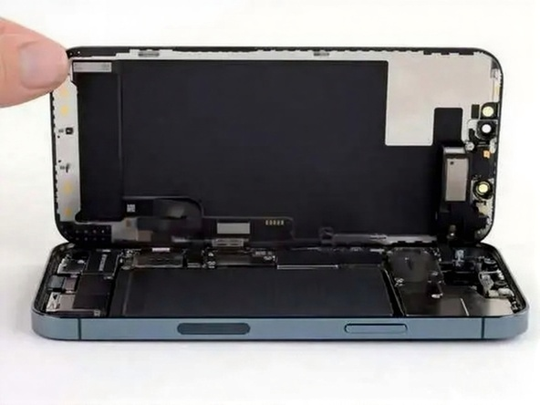

> 使用半年提醒：iphone的电池是真拉啊，换不是快充，但是系统和生态没得说！！

<figure>
  
    <figcaption class="text-center">
    Photo by <a href="https://www.pexels.com/photo/brown-wooden-desk-159618/">Pixabay</a>
  </figcaption>
</figure>

## Table of contents
## 手机被检

因为上次考试，到达考场门口，当时雪很厚，衣服穿着也厚，下车的时候，手机掉在雪地上也没听到，上午场考完才发现手机不在
，打电话给手机，接起来的是一位"文质彬彬"的女孩，大致说是她捡到了手机，但是现在不方便给我，说是下午考完试可以碰面给
我。（注意这里并没有说需要收费还是怎么解决~）

于是我和她约定下午考完试，跟他碰个面，在下午考完之后，我第一时间联系了这位女孩，对方说：我帮你拿了一天手机，很辛苦
的，你准备怎么感谢我。我愣了一下，回复道：那我请你吃个饭吧或者给你发个红包，我提出先见到手机再发钱或者带她吃饭，但是
这位女孩并不打算跟我见面，加了我的微信，把我的战损版neo放在了学校的门房，让我自己去拿。

待我拿到手机之后，发现手机的前置摄像头附近有漏液，内屏有碎裂痕迹，背盖也有碎裂。

## 人的贪婪

幸运是除了摄像头有一点重影，可能因为进雪的问题，话筒有电流，其他都是没问题的，捡到我手机的女孩通过微信联系我，开始我
是商量请他吃顿饭，但是他各种推辞，说晚上有聚会，不合适，然后我说那我给他点外卖，他说外卖看花眼了（可能也是怕地址泄
露），给他发200就可以。

我寻思，我手机就是放在你那保存了一天，最多100就行了，哪怕你吃饭我请你就行了，你变着花样要钱，真的恶心到我了！！！直接屏蔽拉黑。我始终坚信人就是真心换真心，不诚心的我就是流氓！我姐还让我拿了一瓶好点的化妆品给她，现在看来也没这个必要了...

## 换手机

经过了大概一个月的考虑吧，我最终入手了苹果的16pm，之前也了解到苹果的缺点，比如续航差、打游戏电池发热、信号不行、接电
话会断开数据链接等等，经过对比我觉得我是可以接受的，对我来说都不是什么大缺点，虽然价格是贵，但对我这个资深安卓用户，
对ios的生态、系统以及颜值都是比较期待的 。

## 开箱前注意

一定要开箱录制视频，苹果在中国的旗舰店只有天猫和[苹果官网](www.apple.com.cn/)其他统统为经销商。可能存在 拆封机、摸摸机甚至是美版转的机子。

大致对验机做个总结，也是看了不少视频

- 看封条 有没有鼓包或者封条侧边宽窄不一致的
- 查看盒子上的序列号 去官网查询保修日期 正常这里是查不到的 查不到代表没问题
- 看盒子上的序列码是否正确 4.拆封之后，重点来了，必须检查，手机的相机有没有灰尘，边框、屏幕有没有划痕，任何让你感到
不适的地方（品控问题）一定要在激活之前仔细查看，否则日后很扯皮！
- 拆封之后，重点来了，必须检查，手机的相机有没有灰尘，边框、屏幕有没有划痕，任何让你感到不适的地方（品控问题）一定要在激活之前仔细查看，否则日后很扯皮！
- 然后就可以拆封了，撕下屏幕膜，右下角有一个感叹号 ，再次核对序列号和sm码是否和包装盒一致，然后就可以一步步激活了
- 可以再录个音、拍个照和按住图标绕着屏幕滑动 测试是否断触，如果这些都没有问题 恭喜你安全下车

## 感人感受
我个人感觉安卓是没有什么选择权的，参数都很简单，我很多想设置的都设置不了，“傻瓜”体验，轻松上手是一大优点。苹果如果你想得到对系统的体验，就需要研究一下了，他对每一个app都可以实现自己的控制，不仅仅是一个权限的赋予和拒绝。

目前体验到的就是快捷指令了吧 真的很方便 还有这个侧边拍照 虽然很多人说是鸡肋会误触 但我个人感觉良好。 说一说缺点吧：

1. 消息刷新慢 如果你为了电池损耗最小化关掉app后台刷新 你每次打开app才会更新消息（但是会有提醒哈）
2. 充电速度 我已经是30w的充电器了 依旧很慢 用过120w快充的买iphone可以磨磨性子 据说这样是为了保护电池 涓流充电
3. siri 不知道是我的问题还是siri的问题 感觉我的siri跟智障一样 手机朝上都喊不起来！手机朝下更别提了。 别的缺点暂时没有明显的感受
4.信号是真的差，下地下室就没了，建议数据卡用移动，联通>电信

## 小惊喜
我买iphone之前看了很多小红书的文章，都在用爱思看手机配件的代工厂，什么三星、LG等等，其实我想说，除非是屏幕出现浅绿
色这种明显的差别，不然的话都差不多，没必要因为一个配置或者电池寿命整日诚惶诚恐，手机只是一个辅助工具，虽然我这样说，
但是我之前安卓会经常性打游戏，买了苹果，连游戏都不怎么玩了，也是一种，物质刺激习惯的伪命题吧！