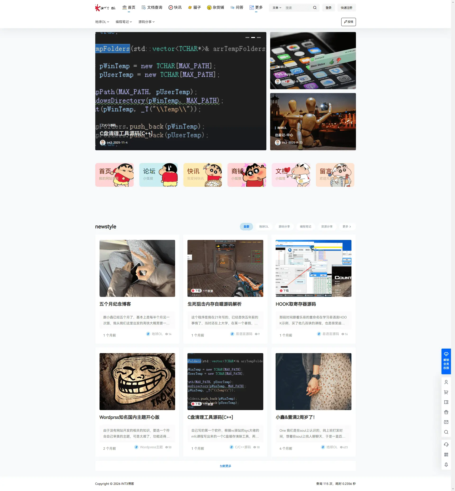

这是美化之后的效果，我个人喜欢整洁大方的观感，如果有喜欢我这个美化的，可以按照如下步骤操作（仔细看）。



## Table of contents

# 文件修改

需要修改的文件在下面这俩个地址

<p>

`/www/wwwroot/wordpress/wp-content/themes/b2/Modules/Templates/Modules`

`/www/wwwroot/wordpress/wp-content/themes/b2/Modules/Templates`

<p class="center" style="color:red">直接替换我给的文件即可（文章末尾）</p><p class="center" style="color:red">请提前做好备份，出现任何问题，本人不负责</p>

----
# CSS自定义代码（**外观-自定义** 插入）

> CSS 美化样式代码(**涉及域名访问的图片请自行替换**)

## 字体导入

```CSS
/字体导入/
@font-face {
 font-family: 'font';
	 font-style: normal;
  font-weight: 500;
  font-display: swap;
	 src: url('https://oss.cvpotato.cn/fonts/HarmonyOS_Sans_SC_Regular.woff2');
}
@font-face {
    font-family: 'mono';
    src: url('https://oss.cvpotato.cn/fonts/JetBrainsMono.woff2');
}
/顶栏设置字体/
.navbar-nav .nav-link {
  font-family: font
}
/页面设置字体/
body{
 font-family: font;
}
/代码块字体/
.hljs-ln {
    font-family: mono,font;
}
```

## 首页六图美化

```css
.Mrxu-block {
	padding-top: 30px;
	position: relative;
}
.Mrxu-block .cut-prev,.Mrxu-block .cut-next {
	position: absolute;
	font-size: 14px;
	top: 63px;
	width: 35px;
	height: 35px;
	text-align: center;
	line-height: 35px;
	color: #CCCCCC;
	background: #F3F4F7;
	border-radius: 50%;
	cursor: pointer;
}
.Mrxu-block .cut-prev {
	display: none;
	left: -55px;
}
.Mrxu-block .cut-next {
	right: -55px;
}
.Mrxu-block .cut-prev:hover,.Mrxu-block .cut-next:hover {
	color: #39AEFF;
	background: #F3F4F7;
}
.Mrxu-circulation {
	height: 228px;
	overflow: hidden;
}
.Mrxu-circulation ul {
	width: 295%;
}
.Mrxu-circulation ul li {
	float: left;
	position: relative;
	width: 5%;
	height: 100px;
	margin-right: 24px;
	z-index: 1;
}
.Mrxu-circulation ul li .Mrxu-content::before {
	content: '';
	position: absolute;
	right: 0;
	top: 0;
	width: 168px;
	height: 100px;
}
.Mrxu-circulation ul li .Mrxu-content {
	position: relative;
	height: 100px;
	font-size: 14px;
	border-radius: 10px;
	transition: 0.2s;
	overflow: hidden;
}
.Mrxu-content .Mrxu-top {
	display: block;
	position: relative;
	box-sizing: border-box;
	padding: 22px 0 0 16px;
	border-radius: 10px;
	overflow: hidden;
	height: 100px;
}
.Mrxu-name {
	position: relative;
	font-size: 26px;
	line-height: 26px;
	margin-bottom: 8px;
	z-index: 1;
}
.Mrxu-hint {
	position: relative;
	z-index: 1;
	text-shadow: 0 0 5px rgba(255, 255, 255, 0.8);
}
.Mrxu-circulation ul li.off:hover .Mrxu-content {
	height: 100px;
}
.Mrxu-circulation ul li:hover .Mrxu-content {
	height: 218px;
	box-shadow: 0 6px 10px 0 rgba(0,0,0,0.10);
}
/一号/
.Mrxu-circulation .color1 .Mrxu-content {
	background: #FFD4D4;
}
.Mrxu-circulation .color1 .Mrxu-top {
	color: #C68686;
}
.Mrxu-circulation .color1 .Mrxu-name {
	color: #5B0000;
}
.Mrxu-circulation li.color1 .Mrxu-content::before {
	background-position: 0 -100px;
}
/二号/
.Mrxu-circulation .color2 .Mrxu-content {
	background: #C9F1ED;
}
.Mrxu-circulation .color2 .Mrxu-top {
	color: #87BAB5;
}
.Mrxu-circulation .color2 .Mrxu-name {
	color: #0C534D;
}
.Mrxu-circulation li.color2 .Mrxu-content::before {
	background-position: -178px -100px;
}
/三号/
.Mrxu-circulation .color3 .Mrxu-content {
	background: #FFECB4;
}
.Mrxu-circulation .color3 .Mrxu-top {
	color: #DEBD83;
}
.Mrxu-circulation .color3 .Mrxu-name {
	color: #844000;
}
.Mrxu-circulation li.color3 .Mrxu-content::before {
	background-position: -534px -100px;
}
/四号/
.Mrxu-circulation .color4 .Mrxu-content {
	background: #FFD4D4;
}
.Mrxu-circulation .color4 .Mrxu-top {
	color: #BD7C7C;
}
.Mrxu-circulation .color4 .Mrxu-name {
	color: #5B0000;
}
.Mrxu-circulation li.color4 .Mrxu-content::before {
	background-position: -1424px -100px;
}
/五号/
.Mrxu-circulation .color5 .Mrxu-content {
	background: #FFE2EF;
}
.Mrxu-circulation .color5 .Mrxu-top {
	color: #D390A7;
}
.Mrxu-circulation .color5 .Mrxu-name {
	color: #840028;
}
.Mrxu-circulation li.color5 .Mrxu-content::before {
	background-position: -712px -100px;
}
/六号/
.Mrxu-circulation .color6 .Mrxu-content {
	background: #FFE2D0;
}
.Mrxu-circulation .color6 .Mrxu-top {
	color: #D49D86;
}
.Mrxu-circulation .color6 .Mrxu-name {
	color: #842100;
}
.Mrxu-circulation li.color6 .Mrxu-content::before {
	background-position: -890px -100px;
}
.Mrxu-content .Mrxu-top i {
	position: absolute;
	top: 0;
	right: -20px;
	width: 130px;
	height: 100px;
	background: url(https://blog.cvpotato.cn/15.png) no-repeat 0 0;
}
.Mrxu-circulation li .icon1 {
	background-position: 0px 0;
}
.Mrxu-circulation li .icon2 {
	background-position: -140px 0;
}
.Mrxu-circulation li .icon3 {
	background-position: -280px 0;
}
.Mrxu-circulation li .icon4 {
	background-position: -410px 0;
}
.Mrxu-circulation li .icon5 {
	background-position: -530px 0;
}
.Mrxu-circulation li .icon6 {
	background-position: -650px 0;
}
.Mrxu-block .Mrxu-content {
	height: 100px;
}
.Mrxu-block .Mrxu-link {
	text-align: center;
	line-height: 26px;
	font-size: 14px;
}
.Mrxu-block .Mrxu-link a {
	margin: 10px 1px 0;
	display: inline-block;
	background: rgba(255,255,255,0.50);
	width: 77px;
	height: 26px;
	border-radius: 13px;
	font-size: 13px;
}
.Mrxu-block .Mrxu-link a:hover {
	background: #fff;
	color: #666;
}
.Mrxu-classify {
	margin: -87px 0 0;
	padding-bottom: 30px;
	white-space: nowrap;
}
.Mrxu-classify li {
	width: 10%;
	position: relative;
	display: inline-block;
}
.Mrxu-classify li::before {
	content: '';
	position: absolute;
	right: -1px;
	top: 2px;
	width: 2px;
	height: 16px;
	background: #DDDDDD;
}
.Mrxu-classify li:nth-child(10)::before {
	display: none;
}
.Mrxu-classify li .iconfont {
	font-size: 16px;
	color: #39AEFF;
	margin-right: 6px;
}
.Mrxu-classify li a {
	margin-left: 6%;
	font-size: 14px;
	color: #666666;
}
.Mrxu-classify li a:hover {
	color: #2CAEFF;
}
.Mrxu-classify li.more {
	display: none;
}
.Mrxu-classify li.more i {
	vertical-align: -3px;
	margin-right: 4px;
}
.Mrxu-circulation li.AnRotate .Mrxu-top i {
	animation: AnRotate 1.2s ease-in-out infinite alternate;
	transform-origin: 76px 90%;
}
```

## 修改按钮颜色

```
#TA-con{/修改按钮颜色/
    background-color: #3478F7;
}
#TA-con:hover {/修改按钮颜色——鼠标移动至按钮/
    background-color: #3478F7;
}
```

## 侧边条颜色

```
#mask path{/修改条颜色 —— 长条/
    stroke: rgb(52 120 247);
}
#mask ellipse{/修改条颜色 —— 点/
    fill: rgb(52 120 247);
}
#mask rect{/修改条颜色 —— 短条/
    fill: rgb(52 120 247);
}
```

## 忘记是修改啥了，自行测试吧

```
.download-box{
display: none;
}
.gg-box .modal-content {
width: 28rem;
overflow: hidden
margin-top: 0;
}
.gg-box-title .gg-title {
width: 100%;
text-align: center;
padding: 0!important;
}
.modal-content .gg-box-title h2 {
font-size: 22px;
margin-bottom: 0;
text-align: center;
font-weight:bold;
}
.gg-box-title .gg-title span {
font-size: 14px;
color: rgba(255, 255, 255, 0.5);
}
.title-bg {
border: 0;
}
.modal-content .gg-title {
padding: 20px 30px 0px 30px;
}
.modal-content .gg-title a {
font-size: 16px;
border-bottom: 1px solid #eee;
padding-bottom: 20px;
display: block;
font-family: Arial;
text-decoration:none
}
.modal-content .gg-desc {
padding: 20px 30px;
font-size: 14px;
letter-spacing: .5px;
padding-bottom: 0;
}
.modal-content .gg-desc p {
color: #909399;
font-family: Arial;
background: #f8f8f8;
padding: 20px;
line-height: 24px;
}
.gg-button a {
border: 0;
display: inline-block;
padding: 8px 12px;
font-size: 14px;
line-height: 20px;
letter-spacing: .5px;
background-color: #206aff;
background-image: -webkit-gradient(linear, left top, right top, from(#006eff), to(#13adff));
background-image: -webkit-linear-gradient(left, #006eff, #13adff);
background-image: -o-linear-gradient(left, #006eff 0, #13adff 100%);
background-image: linear-gradient(90deg, #006eff, #13adff);
-webkit-box-shadow: 0 5px 10px 0 rgb(16 110 253 / 30%);
box-shadow: 0 5px 10px 0 rgb(16 110 253 / 30%);
}
```

## 个人中心美化

```
/个人中心/
.author .author-header {
    margin-top: -20px;
}
.user-panel {
    display: block;
}
.user-panel .avatar {
    margin: 0 auto;
    border-radius: 50%;
}
.user-panel-info {
    text-align: center;
    padding-top: 20px;
    padding-left: 0px;
}
.user-panel-info div{
    margin: 0 auto;
}
.user-panel-info p {
    background: rgba(0,0,0,0);
    margin-right: auto!important;
}
.mask-wrapper {
    height: 270px;
    line-height: 1;
    margin: 0 auto;
    padding: 0;
}
.editor-avatar {
    display: flex;
    align-items: center;
    flex-flow: column;
    height: 100%;
    position: absolute;
    width: 100%;
    justify-content: center;
    background: rgba(41,44,47,.4);
    color: #fff;
    font-size: 20px;
    opacity: 0;
    visibility: hidden;
    cursor: pointer;
    border-radius: 75px;
}
.user-cover-button {
    position: absolute;
    top: 30px;
    right: 20px;
}
.user-panel-info h1 span {
    margin-right: 0;
}
@media screen and (max-width: 768px){
.mask-wrapper {
    height: 150px;
}
.user-panel .avatar {
    width: 100px;
    height: 100px;
    max-width: 100px;
    min-width: 100px;
    cursor: pointer;
    border: 5px solid #ffffff;
    position: relative;
    z-index: 4;
}
}
.vip-current {
    border: initial;
}
.entry-content p > a:hover {
    text-decoration: none!important;
}
/个人中心结束/
```

## 小图标美化

```
/小图标/.icon {width: 1.2em; height: 1.2em;    vertical-align: -0.15em;    fill: currentColor;    overflow: hidden;}/小图标结束/
```

## 文章底部商业版权

```
/文章底部商业提醒/
.shangye {
    color: #fff;
    background: #5282f7 url(https://oss.xkzhi.cn/2025/05/25/sev3md.webp) 3px 3px no-repeat;
    border: 1px solid #5282f7;
    overflow: hidden;
    margin: 10px 0;
    padding: 15px 15px 15px 50px;
    border-radius: 4px;
}
/文章底部商业提醒结束/
```

## 菜单样式美化代码

```
.has_children .sub-menu {
border-radius: 4px;
}
.top-menu .b2-jt-down {
display: none!important;
}
.top-menu-ul .sub-menu-0 {
border-top: 0;
padding: 15px;
transform: translateY(10px);
transition: all .3s;
}
.top-menu ul li {
}
.top-menu ul li:hover .sub-menu-0 {
transform: translateY(0);
}
.top-menu-ul .sub-menu-0>li {
border-left: 1px solid #ebeef5;
position: relative;
}
.b2-menu-3 .sub-menu-0>li>a {
color: #4c4c4c;
padding: 8px 15px;
white-space:nowrap;
overflow:hidden;
text-overflow:ellipsis;
}
.b2-menu-3 .sub-menu-0>li:after {
content: '';
position: absolute;
top: 12px;
left: -5px;
width: 3px;
height: 3px;
border-radius: 50%;
background: #fff;
border: 3px solid #3d7eff;
}
.b2-menu-3 .sub-menu-0>li:nth-child(2n+1):after{
border: 3px solid #f1787f;
}
.b2-menu-3 .sub-menu-0>li:nth-child(3n+1):after{
border: 3px solid #61e1b9
}
.b2-menu-3 .sub-menu-0>li>a:hover {
background: #ebeef5;
}
.b2-menu-3 .sub-menu-0 > li:hover > a, .b2-menu-3 .sub-menu-0 a:hover {
color: #333;
}
```

## 文章样式美化

```
/优设网文章样式开始/
.col-3{
    flex: 0 0 auto; 
    width: 25% !important;
}  
.col-3 .widget-area{
    width: calc(100% - 16px);
    min-width: auto !important;
}
.col-3 .widget-title{
    font-size:23px;
    font-family: "webfont";
    border-bottom: 1px solid #eee;
    padding: 20px 0 20px 42px;
}
.col-3 .b2-widget-hot li.widget-post-none{
    height: 72px;
}
.col-3 .b2-widget-post-order span{
    font-size: 28px;
    height: 36px;
    line-height:36px;
}
.col-3 .widget ul li h2{
    font-size: 14px;
    line-height: 24px;
    margin-bottom: 0;
    -webkit-line-clamp:1;
}
.newstyle .item-in{
    padding:24px 18px 18px;
}
.newstyle .item-in .post-info h2{
    font-size: 19px;
    line-height:30px;
    margin:16px 0;
    font-weight: bold;
    color:#323232;
}
.newstyle .post-thumb{
    border-radius: 4px;
}
.newstyle .post-module-thumb a.thumb-link{
    overflow: hidden;
    display: block;
}
.newstyle .post-module-thumb img{
    -webkit-transition: all .3s;
    transition: all .3s;
}
.newstyle .item-in:hover .post-module-thumb img{
   transform: scale(1.2)  rotate(5deg);  
}
.newstyle .post-info .post-excerpt{
    margin:0 0 5px;
    background: #fafafa;
    padding: 12px 16px;
    font-size: 14px;
}
.newstyle  .post-info .post-excerpt p{ 
    -webkit-line-clamp: 2;
    overflow: hidden; 
    line-height: 25px;
    display: -webkit-box;
    -webkit-box-orient: vertical;
    word-break: break-all;
}
.newstyle .list-footer {
    border:none;
}
.newstyle .list-footer .post-list-meta-avatar img{
    width: 24px;
    height: 24px;
    margin-right: 8px;
}
.newstyle .list-footer span{
    overflow: visible;
    font-size: 14px;
}
.newstyle .post-list-meta-box{
    position:absolute;
    right: 18px;
    bottom: 21px;
}
.newstyle .post-list-meta-box a{
    font-size: 14px;
    color: #b5b5b5 !important;
    padding-left:24px;
}
.newstyle .post-list-meta-box a:hover,
.newstyle .list-footer a:hover{
    color:#0066ff !important;
}
.newstyle .post-list-meta-box a:before{
       content: '#';
    width: 18px;
    height: 18px;
    color: rgba(0, 102, 255,1);
    text-align: center;
    background: rgba(0, 102, 255,0.2);
    border-radius: 50%;
    display: block;
    position: absolute;
    left: 0;
}
@media screen and (max-width: 768px) {
    .newstyle .post-info .post-excerpt{
        margin-bottom: 18px;
    }
    .col-3,ul.b2_gap > li.newstyle{
        width: 100% !important;
    }
    .newstyle .post-list-meta-avatar img{
        display: block;
    }
    .newstyle .post-list-meta-box{
        bottom: 10px;
    }
}
/优设网文章样式结束/
```

# 文件下载

<details>
<summary>修改文件下载地址</summary>
<br>
<a href="https://int3666-my.sharepoint.com/:f:/g/personal/int3_int3666_onmicrosoft_com/IgCcAin707-RQbcAUuo21t6qAeUTBkvqyNqWFFPNu30DqL0?e=SbZBfR" target="_blank">
修改文件下载
</a>
</details>
