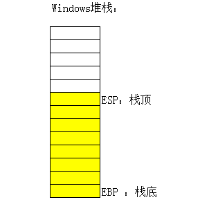

## 函数

计算机的函数，是一个固定的一个程序段，或称其为一个子程序，它在可以实现固定运算功能的同时还带有一入口和一个出口，所谓的入口，就是函数所带的各个参数，我们可以通过这个入口，把函数的参数值代入子程序，供计算机处理，所谓出口，就是指函数的计算结果,也称为返回值，在计算机求得之后，由此口带回给调用它的程序。

思考：

此处我们是通过寄存器讲需要的数据传递给函数的，还可以有其他的方式吗？
** 有的兄弟！可以通过寄存器存放参数 然后在程序需要使用的时候使用它 可以被程序找到的地方 都可以视为传递成功 **
思考：

函数的计算结果除了放在寄存器中，还可以放在什么地方？
** 还可以放在内存中 **

## Windows堆栈的特点

1、先进后出

2、向低地址扩展

什么是堆栈平衡：

Windows中的堆栈，是一块普通的内存，主要用来存储一些临时的数据和参数等

可以把Windows中的堆栈想象成是一个公用的书箱,函数就像是使用箱子的人

函数在执行的时候，会用到这个书箱，把一些数据存到里面，但用完的时候

一定要记得把书拿走，否则会乱的，也就是说，你放进去几本书，走的时候

也要拿走几本书，这个就是堆栈平衡.

其他海哥也没有讲啥，基本就是画堆栈图和提问
