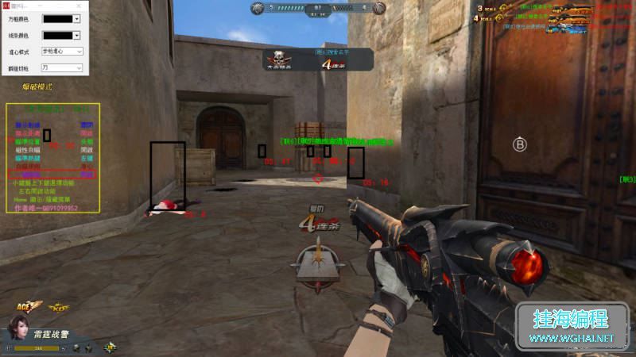
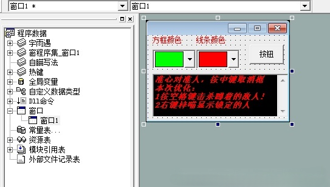
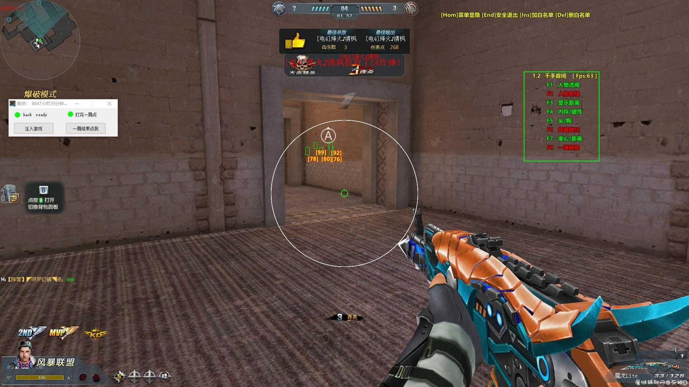
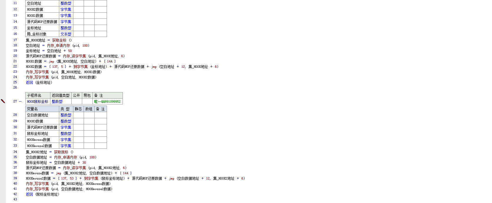
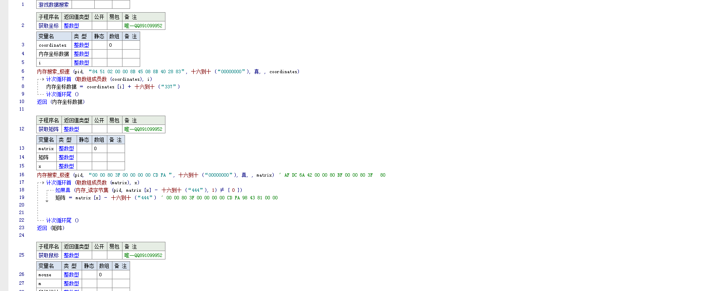

## SKII
这个程序是我在21年写的，已经是快五年前的事情了，当时还在上大学，在某一个暑假，看到了"妲己霸图图"(好像是这个名字,而
且此人是个圈钱仔 经常收了钱不发源码)，发自己买的生死狙击的方框源码，好像是开源了，没有带模块，只有源码，刚好自己学了HOOK，还写过获取寄存器值的工具

当时他用的是超级模块中的超级hook，源码我已经找不到了，我写的第一个辅助名字是SKII，只有单透 

还有一个瞬狙，这份源码我已经不在了，有些论坛转载的也报404了或者是充钱才能下载
## 千手

阵营没办法区分 弄了个白名单删除数组中的对象实现不遍历人物信息

之后我觉得光一个透视，没有自瞄，老被秒，于是我就花了点时间找到了鼠标的特征码，实现了内存自瞄，直接通过改变游戏鼠标的数值瞬间锁到敌人的身上，不是通过移动鼠标api实现的。
其实主要位置是HOOK集和数据搜索这个程序集
## 下载地址

下载地址1（Onedrive）:[生死狙击内存透视自瞄源码](https://int3666-my.sharepoint.com/:u:/g/personal/int3_int3666_onmicrosoft_com/IQBObzMHzzY7QIThMGl2Vxk3AfbrU-IrQqjV_4xnRVEyE-Y?e=dYHxfe)
下载地址1（蓝奏云）:[生死狙击内存透视自瞄源码](https://shenxiu.lanzout.com/idrpB3g0xu6j)
